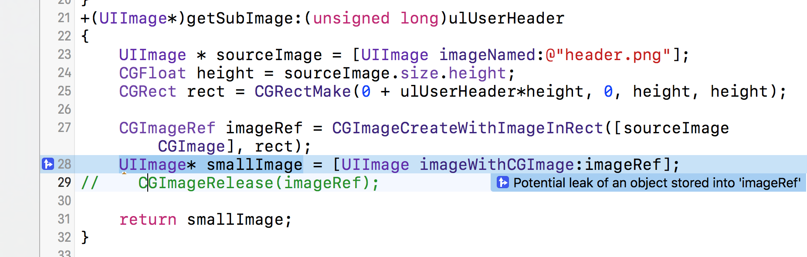
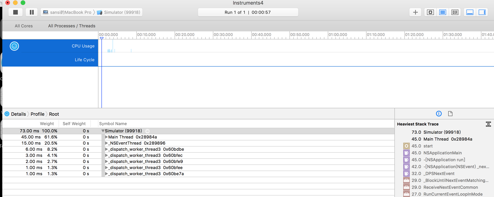
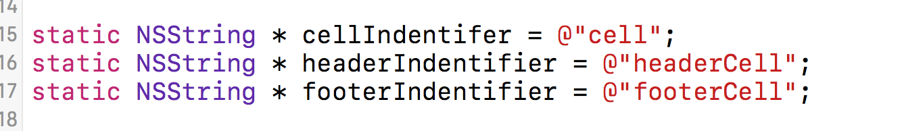
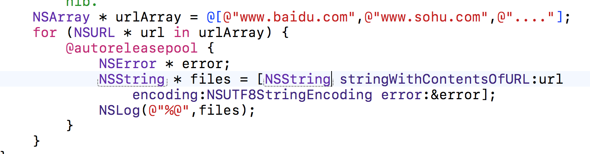
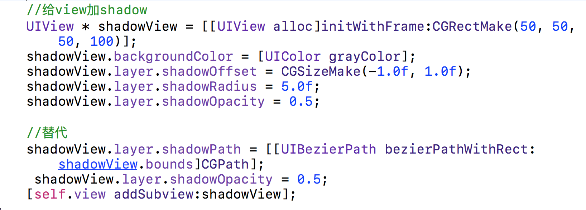

# iOS性能测试是：
* 资源损耗
* 内存泄漏
* 流量消耗
* 耗电功率
* 渲染效果
* 加载时间

## 耗电原因
* CPU(唤醒及使用)
* Network（网络访问）
* Location（定位功能）
* Background（后台运行功能）

### Analyze 静态分析

1、Analyze主要在于静态分析内存泄漏及代码逻辑错误

用注释注释掉CGImageRelease(imageRef)这行，虽然开起了arc，不过仍然会导致imageRef对象泄漏。 
使用Analyze进行分析，会看到蓝色标记，而且编译是不会出现的。

### Instruments 耗时分析

#### 打开方式：
* Xcode 工具栏 - >Open Developer Tool - >Instruments
* Xcode 工具栏 -  >Product - >Profile

1、 启动耗时检测-Time profile

* CPU Usage估量时间
* Call Tree计算时间

#### Call Tree：
* Separate By Thread：线程分离,只有这样才能在调用路径中能够清晰看到占用CPU最大的线程；
* Invert Call Tree：从上到下跟踪堆栈信息.这个选项可以快捷的看到方法调用路径最深方法占用CPU耗时；
* Hide System Libraries：勾选后耗时调用路径只会显示app耗时的代码,性能分析普遍我们都比较关系自己代码的耗时而不是系统的；
* Top Functions：按耗时降序排列。 

Running Time列中显示运行每个方法所耗费的时间，根据耗时和占比猜测是否有代码需要优化。双击中间主窗口中的方法名进入具体的代码行查看，耗时多的代码行有颜色标记，并显示占比。

1. 追踪最耗时的所有代码：
2. 找到最耗时的线程：
3. 评估总体代码运行时间：

CPU处理：

* 矢量化已获得更多的数据处理速度
* 并行化以更有效地使用可用资源
* 优化代码在短时间内完成线程
* 不要在循环中浪费时间 

Network处理：

* 客户端尽量减少请求
* 服务器和客户端采取同步机制
* 通信协议的优化
* 服务端尽量做多的逻辑处理和解析

##### 小技巧

1. cell的重用：除了本身的cell，在使用header和footer时也要重用cell

2. 正确的数据存储 
 NSUserDefaults:适用于小数据的存储. 
 Core Data、SQLite：适用于大数据的存储. 
 XML、Plist：结构化档案存储.
 
3. 使用Autorelease Pool 
当你需要创建很多的临时对象时需要及时的释放它们

4. 设定shadowpath 
当你需要给view设定阴影时使用

### App启动
* 链接和载入：可以在Time Profile中显示dylid载入库函数，库会被映射到地址空间，同时完成绑定以及静态初始化。

* UIKit初始化：如果应用的Root View Controller是由XIB实现，也会在启动时初始化。

* 应用回调：调用UIApplicationDelegate的回调：application：didFinishLaunchingWithOptions

* 第一次Core Animation调用：在启动后：UIApplication_resportAppLaunchFinished中调用CA::Transaction：：commit实现第一帧画面的绘制。

####启动时间获取

在main.m中：
<pre>
CFAbsoluteTime StartTime;
int main(int argc, char **argv) {
  StartTime = CFAbsoluteTimeGetCurrent();
  }
  </pre>
然后在AppDelegate的回调方法 application:didFinishLaunchingWithOptions 中添加：
<pre>
dispatch_async(dispatch_get_main_queue(), ^{
    NSLog(@”Lauched in %f seconds.”,  (CFAbsoluteTimeGetCurrent() – StartTime)); 
});
</pre>

